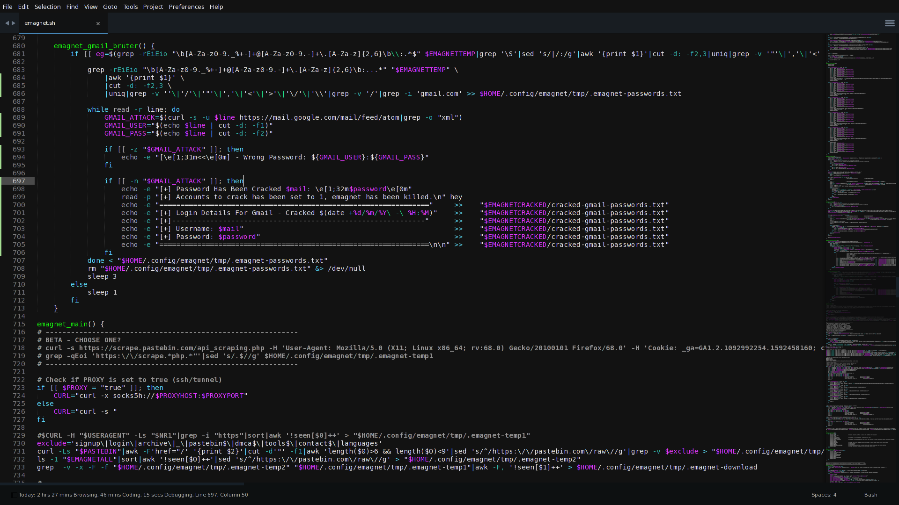
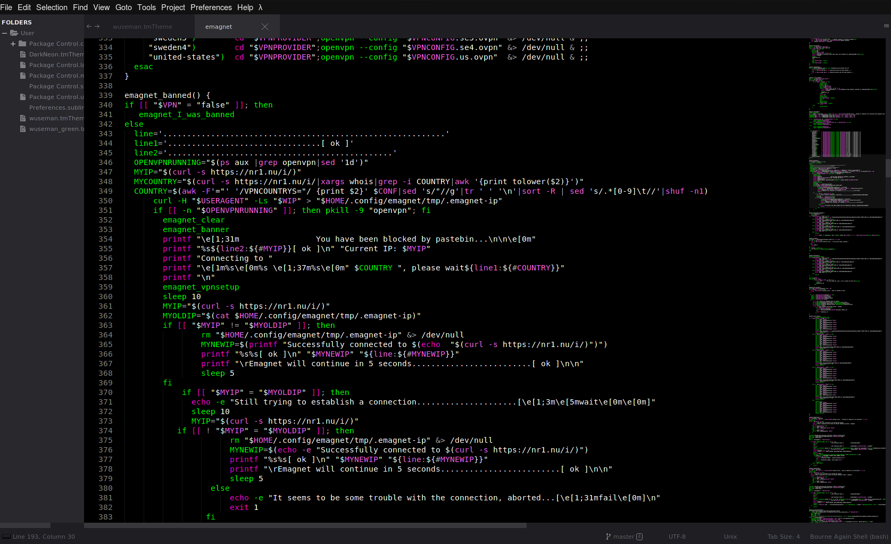
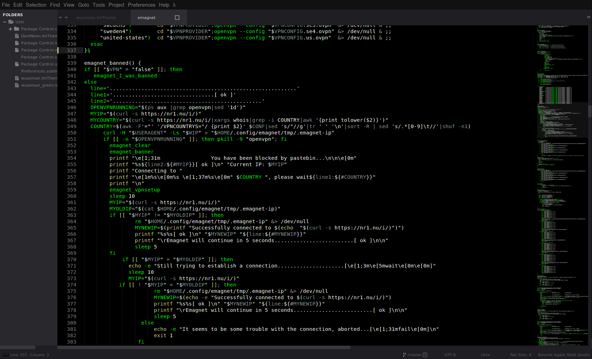

# Sublime Themes

My color configuration for Sublime text editor. Modded for .sh syntaxes only

### Previews

#### wuseman-sublime.tmTheme (Main)

#### wuseman.tmTheme 

#### wuseman_green.tmTheme

## Getting Started:

  Via GIT:

    git clone https://github.com/wuseman/wtheme-sublime ~/.config/sublime-text/Packages/wuseman

## Authors: 

* **wuseman <wuseman@nr1.nu\>** 

## License

This project is licensed under the GNU General Public License v3.0 - see the [LICENSE.md](LICENSE.md) file for details

## END
